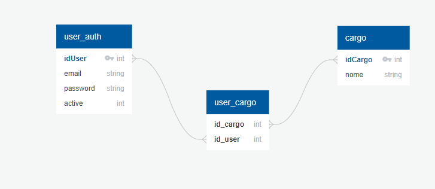

# JWT AUTH
**Java version 17**

---

* **Objetivo**

Fazer uma autenticação no usuário através do Spring security com JWT TOKEN

Onde ao salvar um usuário já vai ter salva a senha dele criptografada no bd, para assim autenticar quando fazer a requisição,
liberando o token desse usuário

---

* **Preparando o ambiente**

Pra fim de estudos é só rodar a aplicação, tudo está no banco em memória h2 no link http://localhost:8080/h2-console

---

* **Exemplo diagrama db**

Onde o usuário vai ter vários cargos/role e cargos poder ter vários usuários
na past init utilizando o StartAppCargo implements com o CommandLineRunner já deixo salvo dois cargos USER com id 1, ADMIN com o id 2.
Então assim que a aplicação rodar já vai salvar
só basta criar os usuários.



---

### Endpoints

Swagger

http://localhost:8080/swagger-ui/index.html#/

---

Postman

* **POST**<br />
Criar uma usuário http://localhost:8080/create-user <br />Exemplo payload

Na lista de cargos podendo ser 1 para User e 2 para Admin, e é claro pudendo colocar os 2 cargos
```
{
  "email": "alison@hotmail.com",
  "password": "123",
  "cargos": [
    1
  ]
}
```

* **POST**<br />
  Autenticar um usuário http://localhost:8080/auth <br />Exemplo payload
```
{
    "email": "alison@hotmail.com",
    "password": "123"
}
```

---

* **PUT**
<br />Desativar uma conta http://localhost:8080/disabled-user/{idUser} <br />

Exemplo resposta
```
{
  "idUser": 1,
  "email": "alison@hotmail.com",
  "active": 0
}
```

---
* **GET**
  <br />Lista das contas desativadas http://localhost:8080/list-user-disabled <br />

Exemplo resposta
```
{
  "idUser": 1,
  "email": "alison@hotmail.com",
  "active": 0
}
```
---
### Autorizações
Permitindo todos criar conta e autenticar, apenas o ADMIN pode desativar contas e ver a lista de contas desativas.

```
 @Bean
    public SecurityFilterChain filterChain(HttpSecurity http) throws Exception {
        http.headers().frameOptions().disable().and()
                .cors().and()
                .csrf().disable()
                .authorizeHttpRequests((authz) ->
                        authz.antMatchers("/auth", "/create-user").permitAll()
                                .antMatchers(HttpMethod.PUT,"/disabled-user/**").hasRole("ADMIN")
                                .antMatchers(HttpMethod.GET,"/list-user-disabled").hasRole("ADMIN")
                                .anyRequest().authenticated()
                );
        http.addFilterBefore(new TokenAuthenticationFilter(tokenService), UsernamePasswordAuthenticationFilter.class);
        return http.build();
    }
```
---
* **Criptografia**

Utilizando o BCrypt para a senha.

```
@Bean
    public PasswordEncoder passwordEncoder() {
        return new BCryptPasswordEncoder();
    }
```


